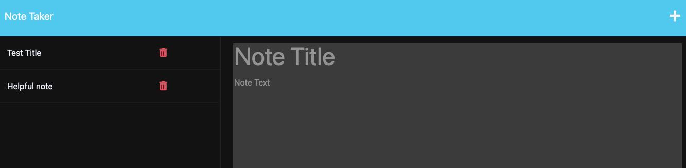

# Note Taker Express

## Description 
Given a starting front end code base, I built out the routes to back end using express.js to have notes saved to a json file. It offers the user the ability to add, review and delete notes. 

## Installation
Dependecies needed (Express & UUID);

## Usage

Create and add notes for helpful daily use/tracking. Delete notes once completed. 

### links
Github: https://github.com/DSStad/Note_Taker_Express
Heroku: https://agile-brushlands-35543-c9b8ba6869ff.herokuapp.com/notes

## Credits

DU-Boot camp provided started front-end code within the public directory.

